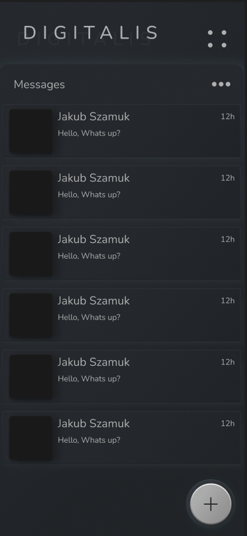
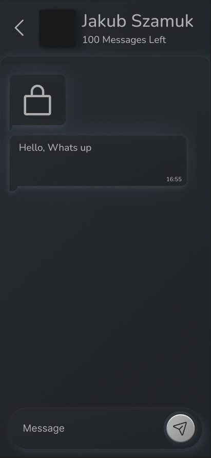

# Digitalis - An Overly Encrypted Chat App

## Features:
- End-to-end encryption: All messages are encrypted using perfect cryptographic algorithms to overly protect your messages.
- User authentication: Users have to authenticate themselves using three forms, the email, password and an app embedded app key that ensures only authorised clients can access the app.

## Security Specifics:
I wrote there "perfect encryption", That is no exagerration, I am using the vernam cypher for mathematically perfect encryption, provided that the key exchange is secure this form of encryption produces cypher text where each character is equally likely to be any other random character

More info:
- One key per chat per member of chat ensuring if a key is compromised only that users messages are compromised, not the entire chat
- Client side encryption of the stored keys using the password
- App key ensures only one client can access the chat portal and therefore access the encrypted messages
- Plain text NEVER leaves the clients device, the server only acts as a middleman to store and transmit encrypted messages
- QR code key exchange ensures no digital traces of key, for example no hard drive forensically recoverable keys
- A wrong password or app key will lock down the server, blocking logins 

So what to do to ensure security?

During the key exchange:
- Do not show your QR code to anyone but the recipient, this involves ensuring no CCTV cameras are present
- Do not point your QR code upwards, A satelite may pick up on the code rendering your messages compromised
- Ensure your mobile phone is free of all spyware as all keys are stored EXCLUSIVELY client side

## Installation and usage:

Installation:
1. Clone the Digitalis repository from GitHub.
2. Install the required dependencies using npm.
3. Run the app using `npm start`.
4. Open a react-native configured android emulator
5. Hit `a` on the `npm start terminal`

Usage:
1. Launch the Digitalis app.
2. Log in with your pre-created credentials.
3. Start a new chat or join an existing one.
4. Send and receive encrypted messages.

-----------------------------------------

## Potential upcoming features
- Group chats: Digitalis supports group chats, allowing multiple users to communicate securely in a single conversation.
- File sharing: Users can share files securely within the app, with the files being encrypted during transmission.

### Todo List
- [X] Message storage, Sending
- [X] Message, key Statistic Api-Route
- [X] Hash password
- [ ] Hash app_keys
- [X] App keys need to verify there is only one version of the client
- [X] App design
- [X] App developement **Started

- [X] Create the chat screen

- [ ] Current deployment

### Design Images:

Creator: Jakub Szamuk
